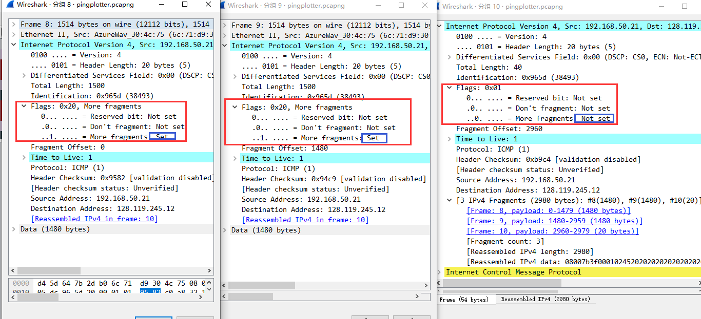

# 计网实验 (PingPlotter)

王章瀚 PB18111697

---

## 问题与回答

### 1. 
> Find the first ICMP Echo Request packet that has TTL=1, is this packet being fragmented? If yes, how many fragments?

根据以下截图可以看出来，这个包被 fragment 了，有 3 个 fragments.

### 2. 
> How the packed is fragmented and resembled? For each fragment, how to tell if it is the last fragment, and how many bytes are contained in each fragment? Print the packets and answer by highlighting the relevant fields.

当一个数据包超出 MTU 时，它会被分片。分片的方式是，保持每个包的 ID 相同，但设置 Flags 比特位，以标志 `Don't fragment` 和 `More fragment`。如下图。

而 `More fragment` 就标志着本分片是否是最后一个分片，如果是 1，则表明还有分片，那么就不是最后一个。反之亦反。
重组的操作就是基于 `more fragment` 和 `id` 进行的，同一个 `id` 内的包，只要判断收集齐了所有包，就可以重组了。

至于包长度，可以看到如下图，前两个都是 1500 bytes, 其中 20 bytes 为包头，而剩余 1480 bytes 为数据。对于第三个，也就是最后一个包为 40 bytes，其中也是 20 bytes 为包头，20 bytes 为数据。
列表言之：

||包1|包2|包3|
|:-|:-|:-|:-|
|总长(bytes)|1500|1500|40|
|包头(bytes)|20|20|20|
|数据(bytes)|1480|1480|20|

### 3. 
> What packet is returned from the router when TTL expires? What is contained in the payload of the packet?

类似这样的包都是 TTL expires 的情况.

其 payload 中就由和发出去的类似的内容填充，这里是一堆202020...
如下：

### 4. 
> Which link crosses the Pacific, give the router addresses at the two ends of the link. Explained your reason.

应为 202.97.90.29 和 202.97.41.202
首先根据时延突然变大(途中蓝色框出)估计，大概就是这个位置。

并且用相关软件确认了一下，表明确实是的

### 5. 
> How long is the trans-Pacific link? (given that a bit transmits 2*10^8 m/s in fiber).

平均时延大约是 155.5 ms, 由于距离很长，可以只考虑为传播时延，因此计算如下：155.5ms * 2*10^8 m/s / 2 = 15550 km，与实际距离基本相符。
